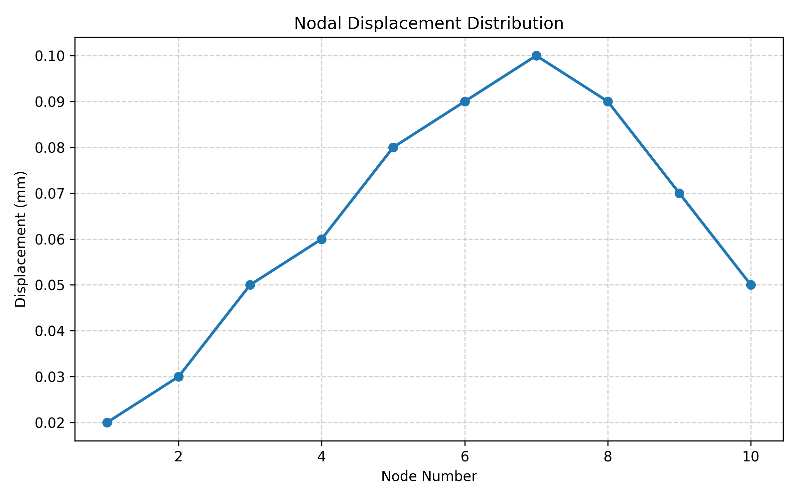
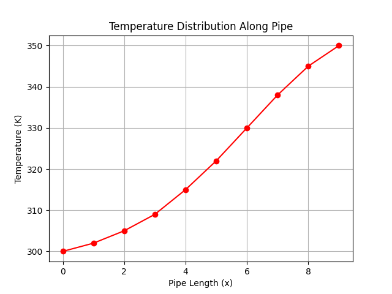

# Research & Projects

My research focuses on **manufacturing-aware computational engineering**, where numerical simulation, design optimization, and production constraints are treated as a coupled system rather than sequential steps. Through industry-driven research and applied projects, I work at the intersection of **computational mechanics, thermal–fluid systems, topology optimization, and advanced manufacturing**, with the goal of translating simulation-driven insights into **robust, manufacturable engineering solutions**.

---

## Selected Flagship Projects

### Thermal System Design & Optimization of a 193L Refrigerator Platform  
*Lead R&D Engineer — Walton Hi-Tech Industries PLC (2023–2024)*

This project involved end-to-end **thermal–fluid system design and optimization** of a household refrigerator platform, integrating **CFD-based airflow analysis, evaporator optimization, insulation thickness refinement, and mechanical validation** under real production constraints.

Coupled **CFD and FEA workflows** were used to optimize evaporator geometry, airflow distribution, insulation thickness, and structural layout. **Rapid prototyping (FDM)** and DFM-oriented iteration were employed to accelerate validation and reduce design-cycle time.

**Outcome:**  
- 15% reduction in annual energy consumption (143 kWh → 122 kWh)  
- ~10% reduction in material usage through structural optimization  
- ~3 weeks reduction in design iteration time  

---
## SLA Prototyping as a Functional Validation Surrogate for Injection-Molded Components

Developed a systematic prototyping and dimensional validation methodology to evaluate stereolithography (SLA) prototypes as functional surrogates for injection-molded components in appliance product development. The approach involved comparative analysis between CAD nominal geometry, SLA prototype dimensions, and final injection-molded parts across more than 100 components including door caps, handles, base stands, and thermostat knobs.

<b>Key Contributions</b>

<ul>
<li>Developed a three-stage validation workflow: CAD → SLA prototype → injection-molded part</li>
<li>Quantified SLA dimensional accuracy within 0.2–0.3 mm deviation from CAD nominal for standard geometries</li>
<li>Identified tall-wall warping (>30–40 mm) due to residual stresses during photopolymerization</li>
<li>Established design guidelines to mitigate deformation risks in SLA prototypes</li>
<li>Developed reinforcement methodology using ABS/HIPS sheets (1.2–4 mm) for functional testing</li>
</ul>

The methodology enabled reliable pre-tooling validation of form, fit, and assembly, reducing tooling risk and improving design verification efficiency in appliance product development.

<b>Project Outputs</b>

  

  

  

---

### Topology Optimization of Injection-Molded Structural Components for 190L Refrigerator Development  
*Lead R&D Engineer — Walton Hi-Tech Industries PLC*

This project involved the complete redesign of a load-bearing refrigerator cabinet base, transitioning from a metallic structure to an injection-molded polymer component. Rather than directly translating the original geometry, the design was re-conceptualized using **stress-path–guided reasoning and topology optimization**, informed by manufacturing constraints inherent to injection molding.

My work integrated **static structural analysis, vibration assessment, and explicit dynamic simulations (drop tests)** to identify critical load paths and failure modes. Design iterations incorporated **DFM and DFMEA considerations**, including rib layout, wall thickness optimization, and moldability constraints. Rapid prototyping through additive manufacturing supported functional validation prior to tooling.

**Outcome:**  
- ~15% reduction in material usage  
- ~50% reduction in process cost  
- Successful qualification through global reliability and drop tests  
- Implementation in mass production

---

### Process–Structure–Property Optimization of Zinc-Coated Mild Steel Tubes  
*Industrial Materials Research Project*

This project focused on restoring and enhancing the ductility of **cold-drawn, zinc-coated mild steel tubes** used in refrigeration condenser applications, where premature cracking during bending and assembly posed a major manufacturing challenge.

I designed **controlled annealing cycles and composition-optimization studies** to investigate the coupled effects of thermal processing and carbon content on microstructural evolution and mechanical performance. By systematically refining annealing parameters and reducing carbon content from **0.10% to 0.05%**, the work established clear **process–structure–property relationships** governing deformation behavior and failure resistance.

The optimized processing route improved tensile elongation from approximately **25–30% to over 40%**, enabling reliable bending and assembly without compromising corrosion resistance. These findings were translated into **practical manufacturing guidelines**, directly supporting high-volume, defect-free production of condenser tubes.

**Outcome:**  
- Restoration of ductility in zinc-coated steel tubes for forming operations  
- Tensile elongation improved from ~25–30% to >40%  
- Establishment of process–structure–property relationships  
- Implementation-ready guidelines for industrial tube manufacturing

---

### Multiphysics Optimization of Thermo-Mechanical Appliance Components  
*Industry R&D Project*

In this project, I applied **coupled thermal and structural simulations** to optimize appliance components subjected to combined mechanical loads and thermal gradients. The study focused on understanding how temperature-dependent material behavior and thermal stresses interact with structural performance under operational conditions.

Using **FEA–CFD workflows**, I evaluated geometry, material selection, and boundary conditions to balance stiffness, durability, and thermal response while maintaining manufacturability. Design decisions were validated through iterative simulation and prototype evaluation.

**Outcome:**  
- 12% reduction in component weight  
- 15% improvement in stiffness under service conditions  
- Improved thermal robustness without added material cost

---
## Python-Based FEA Post-Processing for Structural Analysis

Developed a Python workflow to automate post-processing of finite element analysis (FEA) simulation data. The script imports structural simulation results and evaluates key mechanical performance metrics including maximum displacement, Von Mises stress, and factor of safety, while generating visualizations of structural response.

<b>Key Features</b>

<ul>
<li>Import FEA simulation results from CSV files</li>
<li>Maximum displacement evaluation</li>
<li>Von Mises stress calculation</li>
<li>Factor of safety estimation based on material yield strength</li>
<li>Visualization of structural response distributions</li>
</ul>

<b>Example Outputs</b>

  

  

## Notable projects

### Thermal System Upgrade of Upright Freezers (334L & 272L)  
*Industry R&D Project (2025)*

This project focused on the **thermal system redesign of upright freezer platforms**, emphasizing airflow management and evaporator cover optimization. **CFD-based analysis** was used to guide geometry modifications aimed at improving cooling uniformity and reducing energy consumption under operational constraints.

---
## Thermal-Fluid Research

## Transient CFD Analysis of a Closed Loop Pulsating Heat Pipe

Performed transient multiphase CFD simulations to investigate the thermo-hydrodynamic behavior of a closed-loop pulsating heat pipe (CLPHP). The study focused on understanding the oscillatory motion of liquid–vapor slugs, phase distribution dynamics, and heat transfer performance under varying operating conditions including evaporator heat flux, condenser temperature, and working fluid filling ratio.

<b>Key Contributions</b>

<ul>
<li>Conducted transient multiphase simulations to analyze oscillatory flow behavior in pulsating heat pipes</li>
<li>Evaluated the influence of evaporator heat flux on phase distribution inside the channel</li>
<li>Analyzed condenser heat transfer performance for different condenser temperature conditions</li>
<li>Investigated the effect of working fluid filling ratio on vapor–liquid flow structure</li>
<li>Visualized transient phase distribution and heat transfer characteristics using CFD post-processing</li>
</ul>

<b>Simulation Results</b>

  

<figure>

<figcaption>
Effect of evaporator heat flux on the volume fraction distribution of water inside the channel at 5 seconds.
</figcaption>
</figure>

 

<figure>

<figcaption>
Variation of condenser heat transfer rate for different condenser temperature conditions.
</figcaption>
</figure>

 

<figure>

<figcaption>
Volume fraction contours of vapor and water for different filling ratios in the pulsating heat pipe.
</figcaption>
</figure>

---
## Python-Based CFD Post-Processing for Pipe Flow Analysis

Developed a Python workflow to automate post-processing of computational fluid dynamics (CFD) simulation data, including pressure drop calculation, Reynolds number estimation, flow regime classification, and visualization of velocity and temperature distributions.

<b>Key Features</b>

<ul>
<li>Import CFD simulation data from CSV files</li>
<li>Automatic pressure drop calculation</li>
<li>Reynolds number estimation based on velocity data</li>
<li>Flow regime classification (laminar / transitional / turbulent)</li>
<li>Visualization of velocity and temperature distributions</li>
</ul>

<b>Example Outputs</b>

  

  

## Research Themes & Methods

Across projects, my work consistently engages with:
- Manufacturing-aware topology and shape optimization  
- Multiphysics simulation (FEA–CFD coupling)  
- Explicit dynamics and failure-informed design  
- Design for Manufacturing (DFM/DFMEA) and DFAM  
- Additive manufacturing for validation and iteration  
- Translation of simulation results into production-ready designs
