## Selected Research Projects

My work focuses on manufacturing-aware computational engineering, where simulation, design optimization, prototyping, validation, and production constraints are treated as an integrated engineering workflow rather than isolated stages.

The research direction across these projects can be summarized as:

<b>Design → Simulation → Optimization → Prototype Validation → Manufacturing Integration → Experimental Correlation → Computational Automation</b>

---

# Simulation-Driven Design & Optimization

## Thermal System Design & Optimization of a 193L Refrigerator Platform  
*Lead R&D Engineer — Walton Hi-Tech Industries PLC (2023–2024)*

This project involved end-to-end thermal–fluid system design and optimization of a household refrigerator platform, integrating CFD-based airflow analysis, evaporator optimization, insulation thickness refinement, and mechanical validation under real production constraints.

Coupled CFD and FEA workflows were used to optimize evaporator geometry, airflow distribution, insulation thickness, and structural layout. Rapid prototyping (FDM) and DFM-oriented iteration were employed to accelerate validation and reduce design-cycle time.

<b>Outcome</b>

<ul>
<li>15% reduction in annual energy consumption (143 kWh → 122 kWh)</li>
<li>~10% reduction in material usage through structural optimization</li>
<li>~3 weeks reduction in design iteration time</li>
</ul>

---

## Simulation-Driven Structural Design, Explicit Dynamics, and Experimental Validation of Refrigerator Components

Conducted simulation-driven structural redesign and optimization of refrigerator structural components under operational and reliability loading conditions. The work integrated CAD-based geometry development, finite element analysis, stress-path-informed structural reasoning, explicit dynamic impact simulation, additive manufacturing validation, and production-oriented design iteration to improve stiffness distribution, durability, and manufacturability simultaneously.

A major focus of the work was establishing correlation between computational prediction and real-world structural response through prototype manufacturing and experimental validation. Structural designs developed through CAD and simulation workflows were physically manufactured and subjected to functional loading, drop-test, and durability validation to evaluate deformation behavior, impact survivability, and structural reliability under production conditions.

<b>Research Focus</b>

<ul>
<li>CAD-driven structural redesign and manufacturable geometry development</li>
<li>Static structural, vibration, and explicit dynamic impact simulations</li>
<li>Stress-path-informed topology and stiffness optimization</li>
<li>Drop-test simulation and impact-response evaluation for polymer structures</li>
<li>Prototype manufacturing and experimental structural validation</li>
<li>Correlation of simulation predictions with physical testing results</li>
<li>DFM/DFMEA-informed production-oriented design iteration</li>
</ul>

Simulation workflows were used to evaluate deformation behavior, stress concentration, vibration response, and impact durability under operational and drop-test loading conditions. Iterative redesign enabled substantial reduction in deformation while maintaining production feasibility and structural reliability.

<b>Simulation & Validation Workflow</b>

  

<figure>
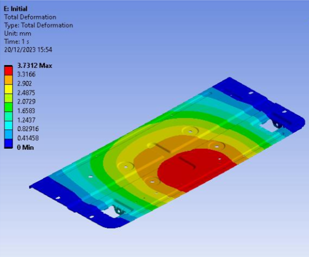
<figcaption>
Initial structural response showing deformation concentration under operational loading.
</figcaption>
</figure>

  

<figure>
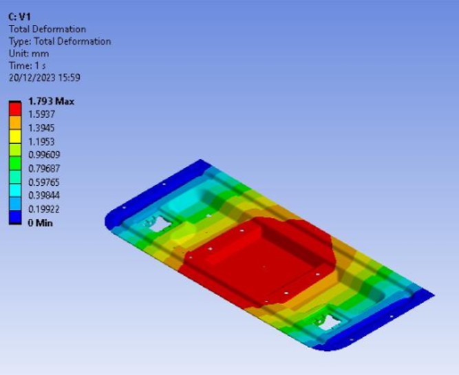
<figcaption>
FEA-guided optimized structural configuration with improved stiffness distribution.
</figcaption>
</figure>

  

<figure>
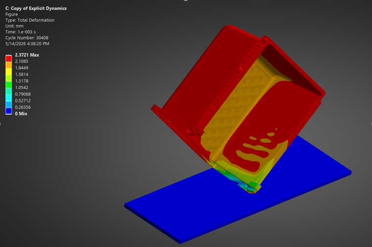
<figcaption>
Explicit dynamic and topology-informed redesign workflow for polymer structural components.
</figcaption>
</figure>

---

## Fatigue Life Prediction & Durability Analysis of Refrigerator Components

Investigating fatigue-life prediction methodologies for refrigerator structural components subjected to cyclic operational loading. The project integrates finite element stress analysis with fatigue-life estimation techniques to evaluate long-term durability, identify high-risk failure locations, and improve reliability prediction under repeated service loading conditions.

<b>Research Focus</b>

<ul>
<li>Stress-life (S-N) fatigue assessment using ANSYS nCode DesignLife</li>
<li>Cyclic load mapping and identification of high-duty stress regions</li>
<li>Automated fatigue hotspot detection and crack-initiation analysis</li>
<li>Damage accumulation evaluation under repeated loading conditions</li>
<li>Durability-oriented simulation workflow development</li>
<li>Bridging deterministic FEA and reliability-focused structural assessment</li>
</ul>

The workflow combines ANSYS Static Structural analysis with fatigue post-processing using nCode DesignLife to estimate component lifespan under cyclic service conditions. Material fatigue behavior was characterized using stress-life methodology through S-N curve-based durability evaluation.

A major focus of the work is understanding the limitation of deterministic structural simulation approaches in predicting real-world reliability behavior. While conventional FEA predicts structural response for a nominal loading condition, fatigue and durability analysis provide insight into damage accumulation, lifecycle variability, and long-term failure risk under operational loading histories.

<b>Durability Analysis Workflow</b>

  

<figure>
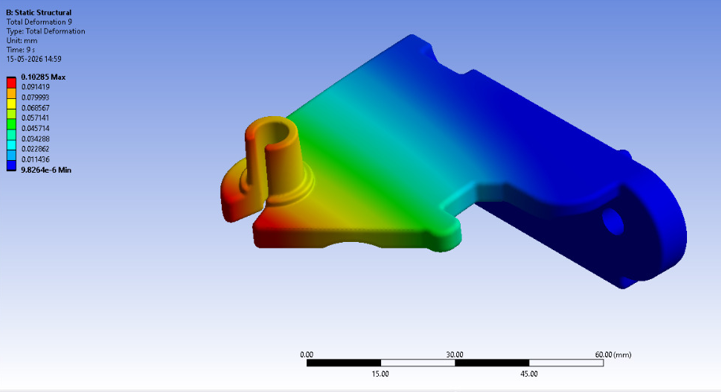
<figcaption>
Stress distribution used to identify fatigue hotspot regions under cyclic loading conditions.
</figcaption>
</figure>

  

<figure>
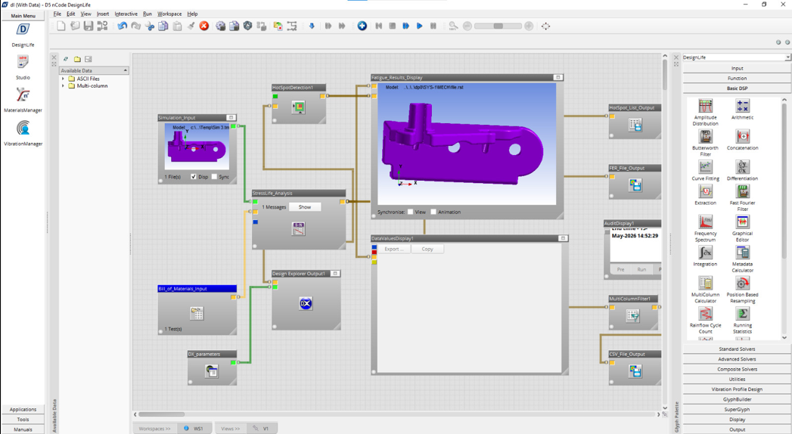
<figcaption>
Integrated ANSYS–nCode DesignLife workflow for fatigue-life prediction and damage accumulation analysis.
</figcaption>
</figure>

  

<figure>
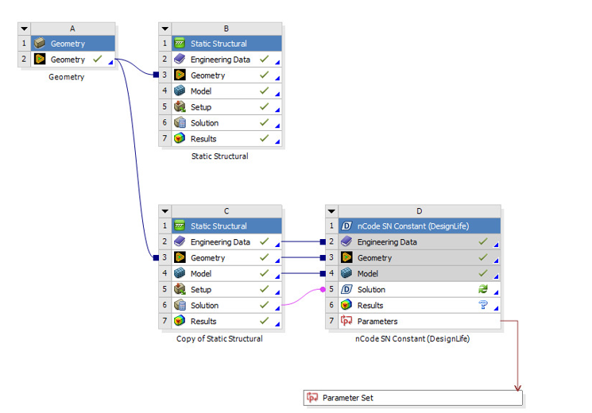
<figcaption>
Structural component evaluated for long-term durability and cyclic loading performance.
</figcaption>
</figure>

---

# Additive Manufacturing & Prototype Validation

## SLA Prototyping as a Functional Validation Surrogate for Injection-Molded Components

Developed a systematic prototyping and dimensional validation methodology to evaluate stereolithography (SLA) prototypes as functional surrogates for injection-molded appliance components. The workflow established a rapid pre-tooling validation framework connecting CAD geometry, additive manufacturing, and production-part verification.

<b>Key Contributions</b>

<ul>
<li>Developed a three-stage validation workflow: CAD → SLA prototype → injection-molded part</li>
<li>Quantified SLA dimensional deviation within 0.2–0.3 mm for standard geometries</li>
<li>Identified tall-wall warping caused by residual stress accumulation during photopolymerization</li>
<li>Established geometry-dependent design guidelines for prototype reliability</li>
<li>Developed reinforcement methodology using ABS/HIPS sheets for structural testing applications</li>
</ul>

The methodology enabled rapid validation of form, fit, assembly, and structural feasibility prior to tooling investment, reducing manufacturing risk and accelerating product development iteration cycles.

 

<b>Prototype Validation Workflow</b>

  

<figure>
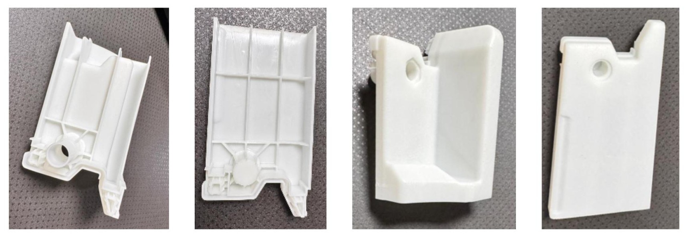
<figcaption>
SLA prototypes used for dimensional and assembly validation prior to tooling.
</figcaption>
</figure>

  

<figure>
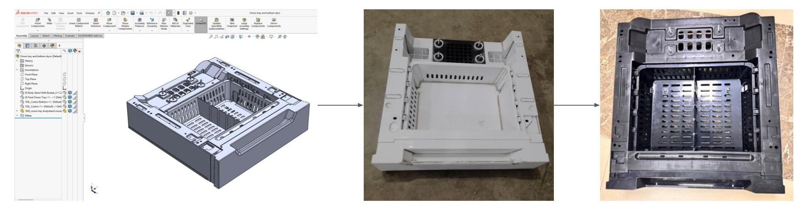
<figcaption>
Comparison between CAD geometry, SLA prototype, and final injection-molded component.
</figcaption>
</figure>

---

# Thermo-Fluid & Multiphysics Research

## Transient CFD Analysis of a Closed Loop Pulsating Heat Pipe

Performed transient multiphase CFD simulations to investigate thermo-hydrodynamic behavior in a closed-loop pulsating heat pipe (CLPHP). The work focused on oscillatory liquid–vapor flow behavior, transient phase distribution, and heat transfer performance under varying evaporator heat flux, condenser temperature, and filling ratio conditions.

<b>Research Focus</b>

<ul>
<li>Transient multiphase CFD simulation</li>
<li>Oscillatory liquid–vapor slug flow analysis</li>
<li>Heat transfer characterization under varying operating conditions</li>
<li>Transient phase distribution visualization</li>
<li>CFD-based thermal performance interpretation</li>
</ul>

<b>Simulation Results</b>

  

<figure>
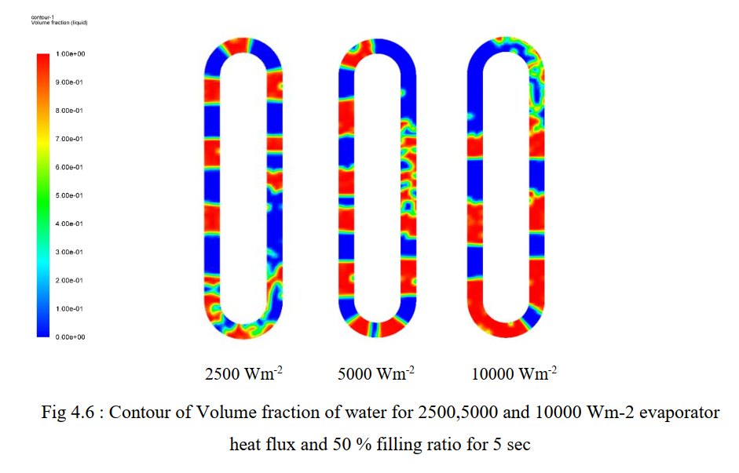
<figcaption>
Effect of evaporator heat flux on water volume fraction distribution inside the channel.
</figcaption>
</figure>

  

<figure>
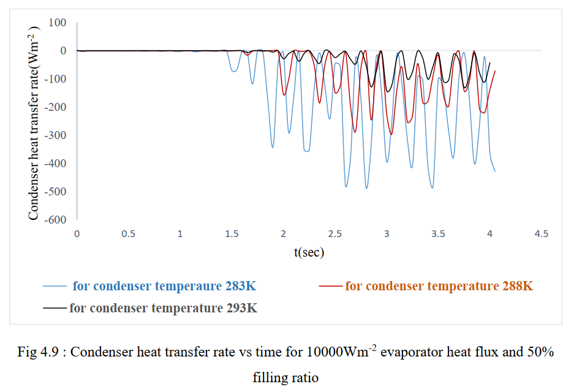
<figcaption>
Variation of condenser heat transfer rate for different condenser temperature conditions.
</figcaption>
</figure>

  

<figure>
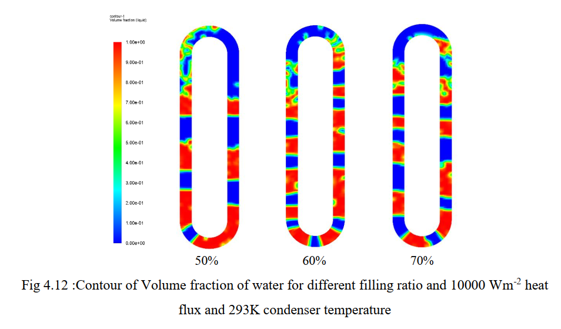
<figcaption>
Volume fraction contours of vapor and water for different filling ratios.
</figcaption>
</figure>

---

## Thermo-Mechanical Stress Analysis of Thin Steel Tubing Under Constrained Thermal Expansion

Performed coupled thermo-mechanical finite element analysis in Abaqus to investigate thermal expansion and constraint-induced stress development in thin-walled steel tubing under fixed-end boundary conditions.

<b>Key Activities</b>

<ul>
<li>3D solid modeling and meshing in Abaqus</li>
<li>Temperature-dependent material and thermal property assignment</li>
<li>Coupled thermal–structural simulation workflow</li>
<li>Thermal expansion and von Mises stress evaluation</li>
<li>Post-processing of displacement and stress contours</li>
</ul>

<b>Simulation Results</b>

  

<figure>

<figcaption>
Von Mises stress distribution under constrained thermal expansion conditions.
</figcaption>
</figure>

  

<figure>

<figcaption>
Thermal displacement distribution during heating.
</figcaption>
</figure>

---

# Materials & Manufacturing Research

## Process–Structure–Property Optimization of Zinc-Coated Mild Steel Tubes

Investigated process–structure–property relationships in cold-drawn zinc-coated mild steel tubes used for refrigerator condenser applications. The work focused on restoring ductility and preventing crack formation during bending and assembly operations through controlled annealing and composition optimization.

<ul>
<li>Designed controlled annealing cycles</li>
<li>Investigated coupled effects of thermal processing and carbon content</li>
<li>Established process–structure–property relationships governing deformation behavior</li>
<li>Improved tensile elongation from ~25–30% to >40%</li>
<li>Enabled defect-free high-volume condenser tube manufacturing</li>
</ul>

---

# Computational Engineering Tools

## Python-Based CFD & FEA Post-Processing Workflows

Developed Python-based post-processing workflows for automated analysis of CFD and FEA simulation outputs. The tools were designed to extract engineering performance metrics, automate result interpretation, and generate visualization-ready outputs for simulation-driven engineering studies.

<b>Capabilities</b>

<ul>
<li>Pressure drop and Reynolds number evaluation</li>
<li>Von Mises stress and factor-of-safety estimation</li>
<li>Automated CSV-based simulation data import</li>
<li>Velocity, temperature, displacement, and stress visualization</li>
<li>Simulation-result interpretation and reporting workflows</li>
</ul>

<b>Example Outputs</b>

  

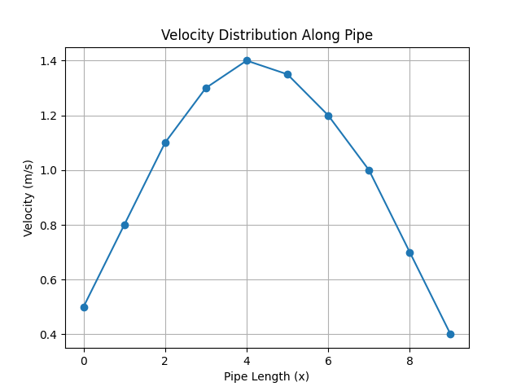

  

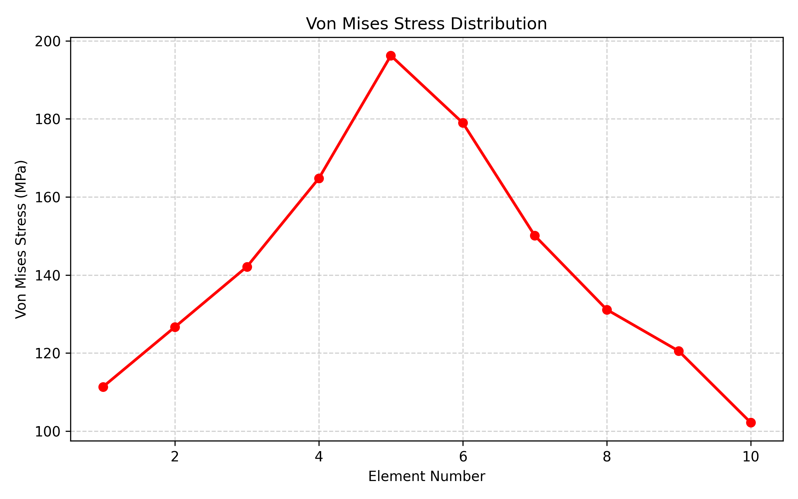

